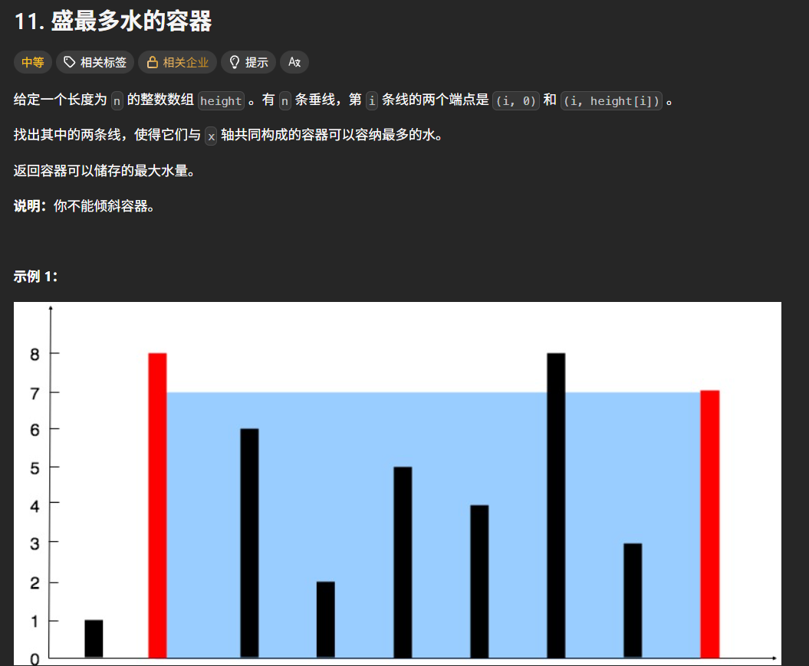
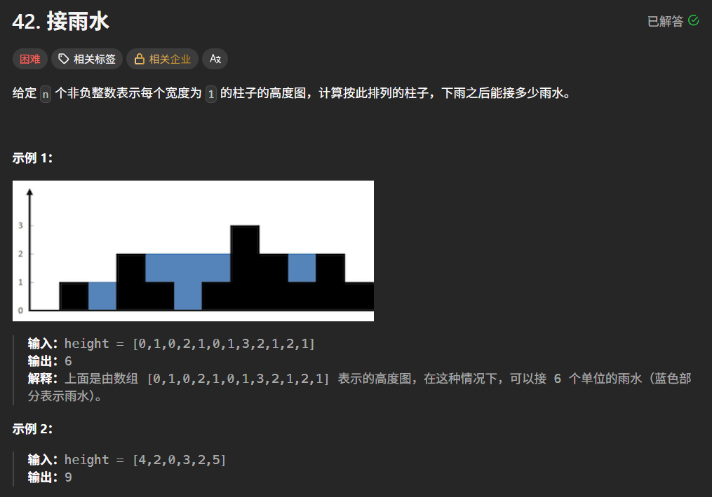
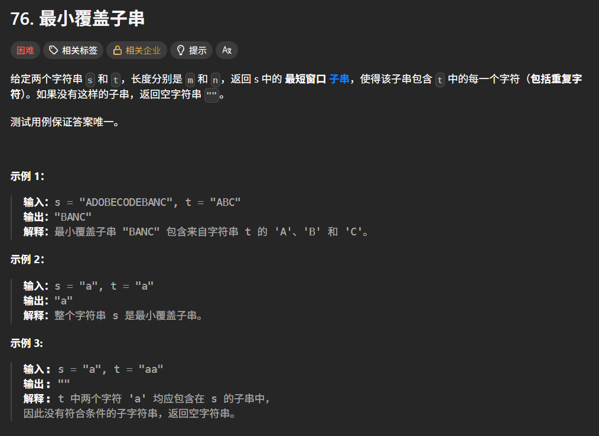

## 双指针

双指针是一个很常用，也很好用的技巧，能显著将嵌套结构的 $O(n^2)$ 复杂度降低到线性 $O(n)$  

简单实例，判断回文数  

```C++
bool isSpecial(int num) {
    int digit[10];
    int k = 0;
    int n = num;
    while (n > 0) {
        digit[k++] = n % 10;
        n /= 10;
    }
    for (int i = 0; i < k / 2; i++) {
        if (digit[i] != digit[k - 1 - i]) {
            return 0;
        }
    }
    return 1;
}
```

### 对撞指针，一个在头，一个在尾向中间靠拢

例1：盛最多的水  
给定一个数组 $height$，表示 $n$ 条垂线。找两条线，与 $x$ 轴共同构成一个容器，使容纳的水最多  



```C++
int maxArea(vector<int>& height) {
    int l = 0, r = height.size() - 1;
    int max_water = 0;
    while (l < r) {
        int cur_h = min(height[l], height[r]);
        max_water = max(max_water, cur_h * (r - l));
        if (height[l] < height[r]) {
            l++；
        } else {
            r--;
        }
    }
    return max_water;
}
```

这题核心逻辑是每次移动高度较矮的一边  
因为面积受限于短板，如果移动长板，宽度变小且高度上限没变，面积只会变小，只有移动短板，才可能遇到更长的板来弥补宽度的损失  

例2：接雨水  
给定 $n$ 个非负整数表示每个柱子的高度，计算按此排列的柱子下雨能接多少水



```C++
int trap(vector<int>& height) {
    int l = 0, r = height.size() - 1;
    int max_l = 0, max_r = 0;
    int res = 0;
    while (l < r) {
        if (height[l] < height[r]) {
            if (max_l < height[l]) {
                max_l = height[l];
            } else {
                res += max_l - height[l];
                l++;
            }
        } else {
            if (max_r < height[r]) {
                max_r = height[r];
            } else {
                res += max_r - height[r];
                r--;
            }
        }
    }
    return res;
}
```

这题的关键在于要计算 `index = i` 处接的雨水，只需要找出左侧 `max_l` 和右侧 `max_r`，计算 `min(max_l, max_r) - height[i]` 即可，采用双指针能很好处理  

### 滑动窗口，同向双指针

例1：最小覆盖子串  
给一个字符串 $S$ 和一个字符串 $T$。在 $S$ 中找出包含 $T$ 所有字符的最小子串  



```C++
string minWindow(string S, string T) {
    unordered_map<char, int> need;
    unordered_map<char, int> window;
    for (char c : T) {
        need[c]++;
    }
    int l = 0, r = 0;
    int vaild = 0;
    int start = 0;
    int min_length = INT_MAX;
    while (r < S.size()) {
        char c = S[r];
        r++;
        if (need.count(c)) {   // 注意检查键是否存在不可直接用 if (need[c]) 检查完会赋初始值 0
            window[c]++;
            if (window[c] == need[c]) {
                vaild++;
            }
        }
        while (vaild == need.size()) {
            if (r - l < min_length) {
                start = l;
                min_length = r - l;
            }
            char d = S[l];
            l++;
            if (need.count(d)) {
                if (window[d] == need[d]) {
                    vaild--;
                }
                window[d]--;
            }
        }
    }
    return min_length == INT_MAX ? "" : S.substr(start, min_length);
}
```
